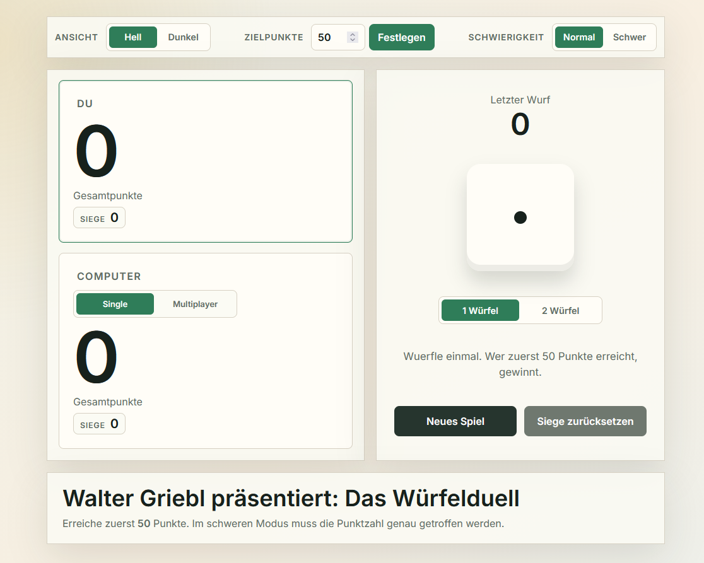

# Goldwurf Royale

**Version 1.20**

Ein kleines, mobiles Würfelspiel für Web und Smartphone.
Spiele alleine gegen die KI oder lokal zu zweit am selben Gerät.

## Features

- Singleplayer gegen KI
- Multiplayer am selben Gerät
- Startspieler auswählbar
- 1 oder 2 Würfel
- Normal- und Schwer-Modus
- Risiko-Modus
- Gamble-Modus mit Zugpunkten und Sichern
- Soundeffekte
- Hell-/Dunkelmodus
- gespeicherte Einstellungen
- gespeicherte Spielernamen
- gespeicherte Siege
- optimiert für Web und Mobile
- installierbar als Web-App

## Online Spielen

https://waltergriebl-blip.github.io/wuerfelduell/

## Als App Nutzen

Die Webseite kann auf dem Smartphone zum Home-Bildschirm hinzugefügt werden.

**iPhone:** Teilen -> Zum Home-Bildschirm  
**Android:** Browser-Menü -> Zum Startbildschirm

## Rechte

Copyright © 2026 Walter Griebl. Alle Rechte vorbehalten.
